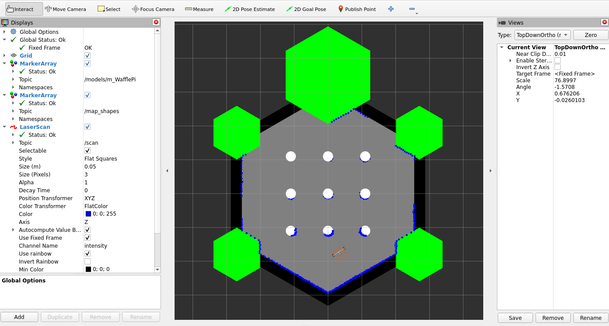

# Lightweight 2D ROS 2 Simulation & Custom RViz UI


## 📖 About The Project
This project provides a minimalist, fast, and mathematically precise 2D simulation for debugging autonomous navigation algorithms without the overhead of heavy 3D engines. 

The environment is fully containerized via Docker. It features a custom **RViz2** visual interface that publishes complex geometric markers (hexagonal grids, background overlays) while successfully addressing common 3D rendering issues like Z-fighting.

### ✨ Key Features
* 🐳 **Dockerized Environment:** Zero setup required. [Flatland](https://flatland-simulator.readthedocs.io/en/latest/) and all dependencies are pre-installed in the provided Docker container based on the `osrf/ros:humble-desktop-full` image.
* 🚀 **KISS Architecture:** Lightweight physics powered by the Flatland 2D simulator (Box2D). Runs smoothly even on low-end hardware or CI/CD pipelines without GPUs.
* 🤖 **Gazebo-Matched TB3 World & Kinematics:** Accurately replicates the classic 3D TurtleBot 3 world from Gazebo into a fast 2D environment. It maintains the precise physical dimensions of the TB3 Waffle (281 x 306 mm) and the exact 6.4 cm offset between the base center and the drive axle, ensuring highly realistic navigation and collision behaviors.
* 🧩 **Collision Layers Solved:** Correctly configured physics layers (`static` and `robot`). The robot's LiDAR freely passes through its own footprint but reflects off walls.
* 🎨 **Custom RViz2 UI:** A ready-to-use Python module (`marker_array_publish.py`) for batch publishing `MarkerArray` messages (hexagons, circles, squares) with perfectly calculated Z-order.
* ⏱️ **Robust Bringup:** An automated launch sequence that handles delays for the Flatland server, TF transformations, and asynchronous robot spawning.

---

## ⚙️ Installation & Build

**Prerequisites:**
* Docker installed on your host machine.

1. Create an isolated  workspace for ROS2 and clone the repository:
```bash
mkdir -p ~/your_folder/src
cd ~/your_folder/src
git clone https://github.com/rprakapovich/tb3_flatland.git
```
2. Navigate to the docker directory and build the container:

```Bash
cd tb3_flatland/docker
docker build -t flatland_sim .
```

## 🚀 Usage
1. Run the Docker Container
To run the container with graphical interface support (X11 forwarding for RViz2), use the following command:

```Bash
cd ~/your_folder/src/tb3_flatland/docker
bash launch_docker.bash
```
2. Project building:

```Bash
colcon build --packages-select tb3_flatland --symlink-install
source install/setup.bash
```
3. Launch the Simulation Stack
Once inside the container, launch the simulation, RViz2, and the custom UI markers with a single command:

```Bash
ros2 launch tb3_flatland tb3_flatland_bringup.launch.py
```
4. Move the Robot
Open a new terminal, attach to the running Docker container, and start the steering GUI to control the robot:

```Bash
# In a new host terminal:
docker exec -it flatland bash

# Run the steering GUI
ros2 run rqt_robot_steering rqt_robot_steering
```
*Note:* The robot listens to the default */cmd_vel* topic.



## 🏗 Architecture Details
**Collision Layers Trick**

This project solves the common 2D simulator issue where a robot's LiDAR detects its own body as an obstacle.

- The robot resides on the `[robot, static]` layers.

- World walls reside on the `[static]` layer.

- The Laser plugin is configured to scan only the `[static]` layer while explicitly ignoring the `base_link` body it is attached to.


**Custom RViz Marker UI**

The `marker_array_publish.py` node programmatically generates a hexagonal grid layout using `Marker.TRIANGLE_LIST`. It applies specific Z-axis offsets (`z = -0.1 + marker_id/100`) to prevent Z-fighting and Alpha-sorting rendering artifacts in the Ogre3D engine used by RViz2.

## 🗺 Roadmap
- [x] Configure base physics and collision layers in Flatland.

- [x] Build custom marker tooling for RViz2 (hex-grids).

- [x] Containerize the workspace with Docker.

- [ ] Add Multi-Robot support (spawning multiple agents with correct namespaces and TF trees).

- [ ] Integrate with Nav2 (Navigation 2 stack).

## 🤝 Contributing
Contributions and Pull Requests are welcome! If you prefer simple, elegant, and lightweight robotics over overly complex setups, feel free to contribute.
